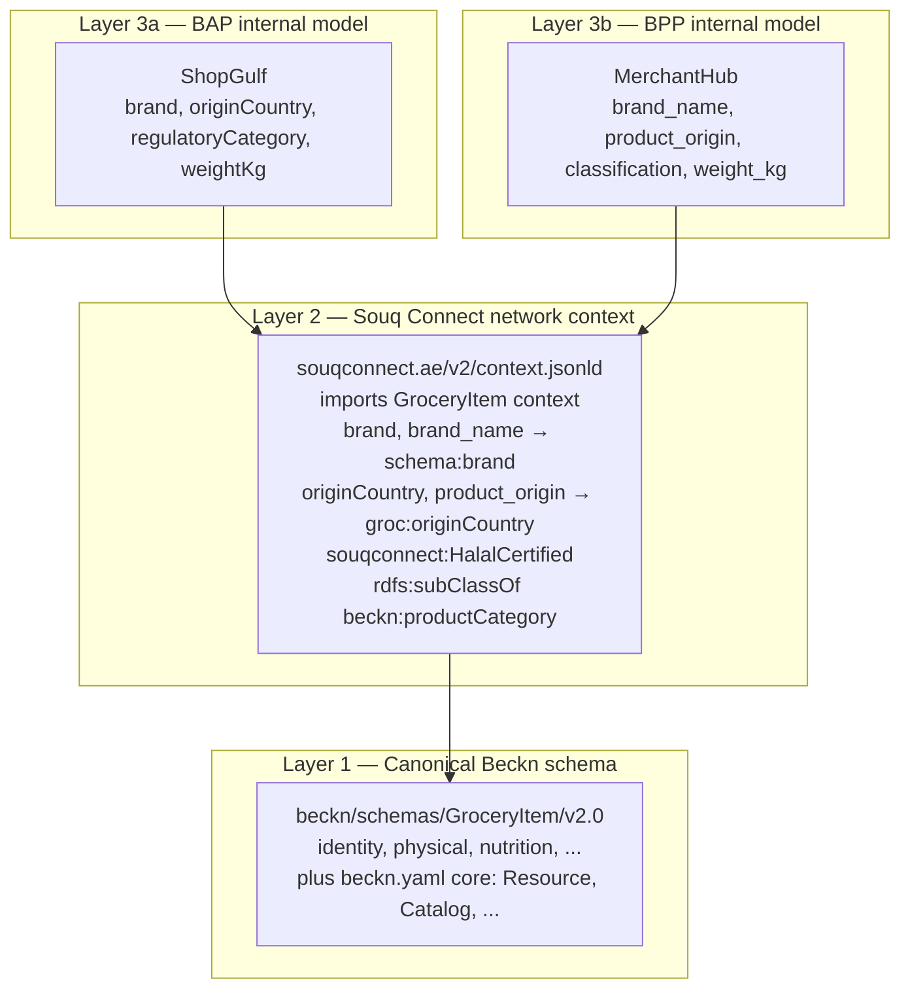
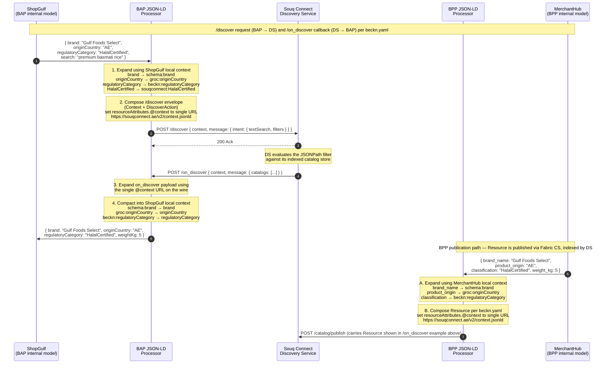

# Managing Schemas in Beckn

## Status of this document

This document is a Working Draft of the Beckn Protocol Specification, published by the Networks for Humanity Foundation. It is subject to change without notice. Feedback may be submitted via the issue tracker linked in the Document Details section.

## Copyright Notice

Copyright © 2026 Networks for Humanity Foundation. Licensed under [CC-BY-NC-SA 4.0 International](https://creativecommons.org/licenses/by-nc-sa/4.0/).

## Document Details

| Field | Value |
|---|---|
| **ID** | NFH-012 |
| **Publication Status** | Draft |
| **Authors** | [Ravi Prakash](https://github.com/ravi-prakash-v), [Networks for Humanity](https://networksforhumanity.org) |
| **Created** | 2026-05-12 |
| **Updated** | 2026-05-12 |
| **Version history** | Draft-01 (2026-05-12): Initial publication. |
| **Latest editor's draft** | [github.com/beckn/protocol-specifications-v2/blob/draft/docs/Managing_Schemas.md](https://github.com/beckn/protocol-specifications-v2/blob/draft/docs/Managing_Schemas.md) |
| **Implementation report** | Not available. This document is at Initial Draft status; report will be linked in the next formal release of this RFC, following merge to main. |
| **Stress test report** | Not available. This document is at Initial Draft status; report will be linked in the next formal release of this RFC, following merge to main. |
| **Conformance impact** | Not determined. This document is at Initial Draft status; impact will be classified in the next formal release of this RFC, following merge to main. |
| **Security/privacy implications** | Unmanaged schema publication creates semantic ambiguity that can be exploited to misinterpret or spoof payload meaning across networks. |
| **Replaces / Relates to** | Supplements [NFH-004 Core Data Schema](./Core_Data_Schema.md) · [NFH-005 Linked Data Schema](./Linked_Data_Schema.md) · [NFH-009 Specification Design Guide](./Design_Guide.md) · [GOVERNANCE.md](../GOVERNANCE.md). Does NOT replace any of these documents. |
| **Feedback** | See subheadings below. |
| **Errata** | To be published. |

### Feedback

#### Issues

- [Open issues labelled NFH-012](https://github.com/beckn/protocol-specifications-v2/issues?q=is%3Aissue+label%3A%22NFH-012%22)

#### Discussions

- [GitHub Discussions labelled NFH-012](https://github.com/beckn/protocol-specifications-v2/discussions?discussions_q=label%3A%22NFH-012%22)

#### Pull Requests

- [Pull requests labelled NFH-012](https://github.com/beckn/protocol-specifications-v2/pulls?q=is%3Apr+label%3A%22NFH-012%22)

---

## Abstract

Beckn Protocol separates structural transport contracts from semantic schema artifacts so that domain-specific meaning can evolve independently of the core protocol. This RFC defines the full lifecycle of a Beckn schema artifact: the conditions that justify creating or extending a schema, where schemas may be published, who is authorized to publish them, the process for creating and extending them, and how production implementations discover and apply them correctly.

---

## Table of Contents

- [Status of this document](#status-of-this-document)
- [Copyright Notice](#copyright-notice)
- [Document Details](#document-details)
  - [Feedback](#feedback)
    - [Issues](#issues)
    - [Discussions](#discussions)
    - [Pull Requests](#pull-requests)
- [Abstract](#abstract)
- [Introduction](#introduction)
- [Specification](#specification)
  - [Definitions](#definitions)
  - [Design Principles](#design-principles)
    - [Principle 1: Semantic Invariance across regions](#principle-1-semantic-invariance-across-regions)
    - [Principle 2: Unification over Standardization](#principle-2-unification-over-standardization)
  - [Why do schemas need to be created or changed](#why-do-schemas-need-to-be-created-or-changed)
    - [1. Abstraction (preferred)](#1-abstraction-preferred)
    - [2. Composition](#2-composition)
    - [3. Extension](#3-extension)
    - [4. Creation (last resort)](#4-creation-last-resort)
    - [What does NOT justify a schema change](#what-does-not-justify-a-schema-change)
  - [Where schemas are published](#where-schemas-are-published)
    - [The Beckn Schema Registry](#the-beckn-schema-registry)
    - [The `beckn/schemas` repository](#the-becknschemas-repository)
    - [The `beckn/DEG` repository](#the-beckndeg-repository)
    - [NFO schema registries — NOT RECOMMENDED](#nfo-schema-registries-not-recommended)
    - [Publication venue selection](#publication-venue-selection)
  - [How NFOs can help](#how-nfos-can-help)
    - [Network-specific JSON-LD context and vocabulary](#network-specific-json-ld-context-and-vocabulary)
  - [Who can publish and extend schemas](#who-can-publish-and-extend-schemas)
    - [Core Working Group](#core-working-group)
    - [DEG Working Group](#deg-working-group)
    - [Network Facilitator Organizations (NFOs)](#network-facilitator-organizations-nfos)
      - [NFOs as external collaborators on `beckn/schemas`](#nfos-as-external-collaborators-on-becknschemas)
      - [Promotion to schema.beckn.io administrator](#promotion-to-schemabecknio-administrator)
    - [Community contributors](#community-contributors)
    - [Summary of authorization by venue](#summary-of-authorization-by-venue)
  - [How schemas are created and extended](#how-schemas-are-created-and-extended)
    - [Design principles for schema authors](#design-principles-for-schema-authors)
      - [Core design principles](#core-design-principles)
      - [Naming a schema](#naming-a-schema)
      - [NOT RECOMMENDED — generic suffixes such as `Attributes`, `Item`, `Offer`, `Resource`](#not-recommended-generic-suffixes-such-as-attributes-item-offer-resource)
        - [Expressing the carrier without polluting the name](#expressing-the-carrier-without-polluting-the-name)
      - [Describing a schema](#describing-a-schema)
      - [JSON-LD conventions](#json-ld-conventions)
      - [Validation gates](#validation-gates)
      - [Artifact precedence](#artifact-precedence)
      - [Managing offending schemas](#managing-offending-schemas)
    - [Schema pack structure](#schema-pack-structure)
    - [Creating a new schema](#creating-a-new-schema)
    - [Extending an existing schema](#extending-an-existing-schema)
    - [Versioning requirements](#versioning-requirements)
    - [Breaking vs. non-breaking changes](#breaking-vs-non-breaking-changes)
    - [Contribution process](#contribution-process)
  - [How schemas are used in production](#how-schemas-are-used-in-production)
    - [Schema discovery](#schema-discovery)
      - [Contributor recognition](#contributor-recognition)
    - [Referencing a schema from a payload](#referencing-a-schema-from-a-payload)
    - [Validation sequence](#validation-sequence)
    - [Version pinning in production](#version-pinning-in-production)
    - [Schema trust and security](#schema-trust-and-security)
    - [Worked example — UAE retail network](#worked-example-uae-retail-network)
      - [Setup](#setup)
      - [Architectural layers](#architectural-layers)
      - [Wire payload — `/discover` request](#wire-payload-discover-request)
      - [Wire payload — `/on_discover` callback](#wire-payload-on_discover-callback)
      - [Why `@context` is a single string](#why-context-is-a-single-string)
      - [Sequence diagram — end-to-end translation](#sequence-diagram-end-to-end-translation)
      - [Pseudocode — edge processing](#pseudocode-edge-processing)
      - [The Souq Connect network context document](#the-souq-connect-network-context-document)
      - [The Souq Connect vocabulary document](#the-souq-connect-vocabulary-document)
      - [Roundtrip stability](#roundtrip-stability)
    - [Worked example — Composing a combo product](#worked-example-composing-a-combo-product)
      - [The correct approach — express the bundle using `beckn.yaml` primitives](#the-correct-approach-express-the-bundle-using-becknyaml-primitives)
      - [Wire payload — `/on_discover` callback carrying the combo offer](#wire-payload-on_discover-callback-carrying-the-combo-offer)
      - [When a `ComboProduct` relationship schema IS justified](#when-a-comboproduct-relationship-schema-is-justified)
      - [Summary — anti-patterns and indicators](#summary-anti-patterns-and-indicators)
  - [Conformance requirements](#conformance-requirements)
- [Conclusion](#conclusion)
- [Acknowledgements](#acknowledgements)
- [References](#references)

## Introduction

Beckn Protocol is intentionally domain-agnostic. The same transport layer, the same message envelope, and the same core data objects serve commerce, mobility, healthcare, energy, and any other value-exchange domain. This generality is the protocol's primary design goal — and it creates an immediate tension. General-purpose core objects cannot carry the full semantic detail that any specific domain requires. A `Resource` used in a healthcare transaction needs attributes that are meaningless in a ride-hailing context. A `Consideration` in a financial transaction needs precision that would be over-specified for a food-delivery use case.

Beckn resolves this tension through its schema extension mechanism. Core objects carry `Attributes` containers — designated extension points whose semantics are defined externally, through JSON-LD schema artifacts, and published in recognized repositories. The core protocol does not change. Domain-specific meaning is layered on top of the stable structural foundation.

This separation is load-bearing. It is the reason a protocol change is not required every time a new domain or use case is added to the ecosystem. It is also the reason the schema layer itself must be governed carefully: schemas are shared semantic contracts, not private implementation details. A vocabulary term published in a shared schema affects every participant that reads it, in every domain and region that references that schema version. Careless schema publication creates the same kind of silent semantic divergence that careless protocol changes create.

This RFC governs the full schema lifecycle for all Beckn schema artifacts, from the initial question of whether a schema is needed at all, through creation, publication, extension, versioning, and production use.

---

## Specification

The key words "MUST", "MUST NOT", "REQUIRED", "SHALL", "SHALL NOT", "SHOULD", "SHOULD NOT", "RECOMMENDED", "MAY", and "OPTIONAL" in this document are to be interpreted as described in [NFH-002 Keyword Definitions](./Keyword_Definitions.md).

### Definitions

**Schema artifact**: A versioned set of files that define the structural and semantic contract for a Beckn domain extension. A schema artifact consists of at minimum an `attributes.yaml` (structural), a `schema.json` (JSON Schema), a `context.jsonld` (JSON-LD context), and a `vocab.jsonld` (vocabulary).

**Schema pack**: A complete versioned directory containing all required and optional schema artifact files for a specific version of a domain schema.

**Attributes container**: A property typed as `Attributes` in the core data model (for example, `offerAttributes`, `resourceAttributes`, `providerAttributes`). This is the designated extension point for domain-specific payload data. It MUST carry a `@context` and `@type` that resolve to a published schema artifact.

**Schema registry**: The index service at `schema.beckn.io` that catalogs published schema artifacts from recognized repositories and makes them discoverable by implementers and validators.

**Core Working Group (CWG)**: The governance body responsible for the `protocol-specifications-v2` repository and for authorizing changes to the core data model.

**DEG Working Group**: The working group that governs schema artifacts in the `beckn/DEG` repository. It exists because the Digital Energy Grid (DEG) initiative was founded and is housed under the Networks for Humanity Foundation. No equivalent working group exists for any other domain — all non-DEG schemas are maintained as a standard open-source project, open to contributions from the global community and reviewed by the maintainers of the `beckn/schemas` repository under CWG oversight.

**Network Facilitator Organization (NFO)**: An entity that operates a Beckn-conformant network. NFOs are encouraged to participate as external collaborators in the `beckn/schemas` repository to help maintain and evolve the schemas most relevant to the networks they manage.

**Master catalog**: A canonical product catalog published by a manufacturer or upstream supplier that downstream implementers reference when building their own catalogs. A master catalog MAY include attached policy-as-code files declaring which attributes implementers SHOULD surface when cataloging the manufacturer's products.

**Policy-as-code**: Executable policy files (typically written in Rego, the language of the Open Policy Agent) that declare constraints on payload structure or content. The Fabric Cataloging Service validates submitted catalogs against any policy-as-code attached to referenced master catalogs before publishing them on the network.

---

### Design Principles

Two principles underpin every other rule in this RFC. Authors and reviewers of schema contributions SHOULD return to these whenever a specific design question is unclear. They are the foundational design principles of the Beckn schema layer; the more granular authoring rules in [Design principles for schema authors](#design-principles-for-schema-authors) are derived from them.

#### Principle 1: Semantic Invariance across regions

A schema's semantics do not change across regions, languages, or networks. A property named `screenSize` on a `Television` schema means the same physical dimension whether the catalog is published in Indonesia, Morocco, or Amsterdam. A `countryOfOrigin` field on a `Resource` carries the same meaning everywhere it appears. **Local policies may differ — one network may require `countryOfOrigin` for regulatory compliance while another treats it as optional — but the meaning of the term itself is invariant.**

This invariance is what makes a single shared schema usable across the entire ecosystem. It is also why NFOs almost never need to publish a forked schema. The variations NFOs encounter — different mandatory fields, different language labels, different category codes, different units of display — are policy-layer, vocabulary-layer, or presentation-layer concerns, not semantic ones. Beckn handles each of them at the right layer:

- **Mandatory-vs-optional variations** are handled by the **policy layer** (network policy, manufacturer master-catalog policy-as-code, fabric cataloging-service validation).
- **Language and naming variations** are handled by the **vocabulary layer** (network-specific `context.jsonld` aliases that resolve to the canonical IRIs).
- **Display-unit variations** (inches vs. centimetres, kWh vs. joules) are handled by the **presentation layer** in BAPs and BPPs at runtime.

When a contributor encounters a perceived need for a regional schema, the right move is to investigate which of these layers the actual variation belongs to. In nearly every real-world case the underlying semantic concept is invariant, and the variation lives in policy, vocabulary, or presentation.

#### Principle 2: Unification over Standardization

Beckn has followed one architectural principle for schema evolution since its 1.0 specification: **unification over standardization**. The principle states that the ecosystem does NOT pre-emptively standardize narrow, prescriptive schemas. Instead, it begins with the broadest meaningful concept, lets attributes accumulate organically as the ecosystem evolves, and abstracts **upward** — never downward into rigid hierarchies imposed from above.

**Attributes accumulate, and that is a good thing.** A schema's attribute set is expected to grow over time. Suppose `beckn/schemas/Television/v1.0.0` is published today with 15 attributes. Five years from now, after every major manufacturer has contributed the attributes exposed in its master catalog, the same schema may carry 80 attributes. Ten years from now, 200. **This is the intended trajectory.** A rich, expressive schema serves the ecosystem better than a narrow one that forces every implementer to add private extensions.

The cost of attribute growth is mitigated by two architectural choices:

1. **No attribute is mandatory by default.** The shared schema enumerates what *can* be expressed, not what *must* be expressed. Networks choose, via policy, which attributes are required for publishing on their network. A UAE retail network may require `countryOfOrigin` and `manufacturerWarranty` on televisions; a Moroccan network may require `energyEfficiencyClass` and `localCertificationCode`. Both networks reference the same `Television` schema.

2. **Manufacturers may attach policy-as-code to their master catalogs.** A manufacturer publishing a master catalog MAY attach Rego policy files declaring which attributes implementers SHOULD surface when cataloging the manufacturer's products. The Fabric Cataloging Service validates submitted catalogs against these Rego policies before publishing them on the network. This allows a manufacturer to enforce its catalog requirements without bilateral coordination with every implementer.

**Abstraction upward, not subdivision downward.** When attributes on a single schema cluster naturally around technology- or category-specific concerns, the schema author MAY break them out into **derived schemas** that specialize the parent — for example, `Television` may eventually be specialized into `CRTTelevision`, `LEDTelevision`, `3DTelevision`. Attributes shared by all of these (display diagonal, resolution, refresh rate) get abstracted **upward** into a parent schema such as `DisplayDevice`. This abstraction continues as the ecosystem matures:

```text
                            Tool
                              ↑
                           Device
                              ↑
                         Appliance
                              ↑
                    ConsumerAppliance
                              ↑
                   ConsumerElectronics
                              ↑
                       DisplayDevice
                              ↑
                       Television
                       ↗      ↑      ↖
            CRTTelevision  LEDTelevision  3DTelevision
```

At every level, the more general schema is the canonical reference for properties that apply to all its descendants. A property declared on `Device` is automatically available to `Tool`, `Appliance`, `ConsumerElectronics`, `Television`, and every leaf type below. A JSON-LD processor that understands only `Device` can still meaningfully process a payload describing a `3DTelevision` — it sees the terms it recognizes and ignores the rest, without semantic confusion.

This is **unification**: the ecosystem converges on shared, increasingly general concepts. The opposite — **standardization-by-decomposition** — would have a central authority decree exactly what a `Television` is, exactly which attributes are allowed, and forbid further evolution. That approach freezes the schema layer prematurely and forces every new use case into a fork or a bilateral extension. Beckn rejects it.

**Implications for schema authors:**

1. **Default to the broader concept.** If you are tempted to publish `OrganicCoffeeBean`, first consider whether `CoffeeBean` with an `organic: boolean` attribute is sufficient — and if `CoffeeBean` does not exist, whether `Bean` or `AgriculturalProduct` is the right starting point.
2. **Welcome attribute growth.** Resist the urge to gatekeep attributes. If a manufacturer or NFO proposes adding `displayBezelMaterial` to `Television`, the default disposition is to accept it unless it semantically duplicates an existing attribute or violates the design principles.
3. **Watch for abstraction opportunities.** When the same attribute appears across multiple sibling schemas (`Television.refreshRate`, `Monitor.refreshRate`, `Projector.refreshRate`), that is a signal that it belongs on the common ancestor (`DisplayDevice.refreshRate`). Raise the abstraction in a follow-up contribution.
4. **Do not subdivide prematurely.** A schema with 30 attributes is not a problem to be solved by forking it into ten narrower schemas. A schema with 200 attributes used across three genuinely distinct product categories may be.

---

### Why do schemas need to be created or changed

When a contributor encounters a perceived gap in the schema layer, the response MUST follow a strict order of precedence. Authors and reviewers MUST attempt each option below in order, and only proceed to the next when the previous is genuinely insufficient.

> **Order of precedence:** 1. Abstraction → 2. Composition → 3. Extension → 4. Creation.
>
> Authoring a new schema is the last resort, not the first.

Before any of these options is invoked, contributors MUST check [schema.beckn.io](https://schema.beckn.io) to verify that no existing schema already covers the use case. Duplicate or overlapping schemas fragment the semantic layer and undermine cross-network interoperability.

#### 1. Abstraction (preferred)

The first response to a perceived schema gap is to ask whether the use case can be expressed by **abstracting an existing schema upward** to a broader concept that subsumes the new requirement. Per [Principle 2: Unification over Standardization](#principle-2-unification-over-standardization), the ecosystem converges on increasingly general schemas. If `Television` exists and the use case is `Monitor`, the right move is often to abstract their shared attributes upward into `DisplayDevice` (or an existing parent like `ConsumerElectronics`) and let both be expressed as specializations — not to author a parallel `Monitor` schema.

Abstraction is preferred because it strengthens the shared vocabulary rather than fragmenting it. Every consumer that already understands the parent concept can immediately process the new specialization with no additional knowledge.

#### 2. Composition

If abstraction does not fit — the use case is genuinely a combination of distinct existing concepts, not a specialization of one — the next response is **composition** using the primitives already provided by `api/v2.0.0/beckn.yaml`. A bundle, kit, combo offer, or related-resources scenario MUST be expressed via:

- `Catalog.resources[]` and `Catalog.offers[]`
- `Offer.resourceIds` and `Offer.addOns[]` (where each `AddOn` is `oneOf [Resource, Offer]`)
- `Offer.considerations[]` for pricing or value terms
- `Resource.id` references inside `resourceAttributes` for inter-resource relationships

A new schema name MUST NOT fuse multiple existing concepts (anti-patterns like `XWithY`, `XAndY`, `XPlusY` are rejected at review). See [Worked example — Composing a combo product](#worked-example--composing-a-combo-product) for the full pattern.

#### 3. Extension

When neither abstraction nor composition fits, the next option is to **extend an existing schema** by adding a property, enum value, or descriptive clarification that closes the gap. Extending is preferred over creating because it preserves the canonical concept and the IRI identity that downstream consumers already process.

An extension is justified when:

- A new property is needed on an existing object type that is already represented in the schema (for example, adding a regulatory certification field to an existing healthcare resource schema).
- A new enumerated value is needed for an existing property (for example, a new payment method code in a financial schema).
- The description or constraint on an existing term needs correction or clarification without changing its meaning.

Extensions MUST NOT change the meaning of any existing term. A change that requires existing consumers to reinterpret a term they already process is a breaking change governed by the breaking-change requirements in [Versioning requirements](#versioning-requirements).

#### 4. Creation (last resort)

A new schema artifact is justified only when **none** of abstraction, composition, or extension can express the use case. Authors who arrive at this option MUST document in the proposal Discussion which of the prior three options were considered and why each was insufficient. A new schema proposal that does not show this reasoning SHOULD be returned to the author.

The most common legitimate reasons for a new schema are:

- **New domain entry.** A domain not previously represented in the Beckn ecosystem (for example, water distribution, carbon credits, legal services) requires a vocabulary that has no overlap with existing domain schemas.
- **New cross-domain standard.** An industry standard body (for example, GS1, HL7, IEC) has published a new vocabulary that Beckn participants in that domain are expected to reference, and no existing Beckn schema maps it.
- **New shared use-case pattern.** A pattern that appears across multiple independent networks in the same domain (for example, a common structure for slot-based appointment booking, or a standard format for regulated product certifications) needs a canonical schema so all networks can share the same vocabulary rather than each defining their own.

The requirement MUST also not be addressable by:

1. an on-Fabric implementation change (a network policy, NFO configuration, or application-layer rule), or
2. an adapter spec change (a translation layer between a domain-specific standard and the Beckn envelope).

#### What does NOT justify a schema change

The following are NOT sufficient justification for a new or modified schema, and proposals on these grounds SHOULD be rejected at the discussion stage:

- **A single network's internal requirement.** If the semantic need exists only within one NFO's network boundary and will not be referenced across networks, it belongs in a network-specific `context.jsonld` or `vocab.jsonld`, not a shared published schema.
- **Replication of an existing term under a different name.** Creating a synonym for an existing, well-named term fragments the vocabulary and breaks cross-network semantic alignment.
- **Encoding business logic or policy.** Schema artifacts define data shapes and vocabulary. They MUST NOT encode rules about what values are valid in a given context, what sequences of states are legal, or what responses are required. Those concerns belong in the Policy Layer.
- **Making an optional field required.** Changing the optionality of an existing field is a breaking change and cannot be addressed by extending the schema alone.

---

### Where schemas are published

#### The Beckn Schema Registry

The Beckn Schema Registry at [schema.beckn.io](https://schema.beckn.io) is the canonical discovery index for all published Beckn schema artifacts. It is managed by the Networks for Humanity Foundation (NFH) through a schema administration console. The registry does not host schema files directly — it sources and indexes them from the `main` branches of recognized repositories. When a schema is merged to `main` in a recognized repository, a sync is triggered on the schema administration console, which publishes the artifact on the website.

Implementers SHOULD use the registry as their primary point of discovery. The registry ensures that only artifacts from recognized, governance-authorized sources at their formally released state are surfaced.

#### The `beckn/schemas` repository

The `beckn/schemas` repository at [github.com/beckn/schemas](https://github.com/beckn/schemas) is the primary publication venue for all domain-specific schema packs intended for broad ecosystem reuse. This includes schemas for all domains **except** energy. Schema packs are currently placed in the `schema/*` directory of this repository (full path: `beckn/schemas/schema/<SchemaName>/<version>/`). Schemas on the `main` branch of this repository are sourced and indexed by the Beckn Schema Registry.

> **Note on directory naming.** The current directory name `schema/` is acknowledged to be a poor choice — both the repository name and the directory name use the same noun. A future re-organisation of `beckn/schemas` is likely to introduce a more elegant naming scheme (for example, a structure that groups schema packs under a domain-neutral folder hierarchy). Schema authors and tooling implementers SHOULD watch the `beckn/schemas` repository for the announcement of this change and update their paths accordingly when it lands.

Schema packs in `beckn/schemas` MUST conform to the schema pack structure defined in [Schema pack structure](#schema-pack-structure) and MUST have passed the contribution process defined in [Contribution process](#contribution-process).

#### The `beckn/DEG` repository

The `beckn/DEG` (Digital Energy Grid) repository at [github.com/beckn/DEG](https://github.com/beckn/DEG) is the publication venue exclusively for **energy domain** schemas. It is governed by the DEG Working Group and was conceived by FIDE in collaboration with the International Energy Agency (IEA). Energy schema packs are placed in the `specification/schema/*` directory of this repository (full path: `beckn/DEG/specification/schema/<SchemaName>/<version>/`). Schemas on the `main` branch of `beckn/DEG` are sourced and indexed by the Beckn Schema Registry alongside those from `beckn/schemas`.

> **Note on directory naming.** As with `beckn/schemas`, the directory layout in `beckn/DEG` may be reorganised in a future release for greater clarity. Authors SHOULD watch the repository for announcements.

All non-energy domain schemas MUST be published to `beckn/schemas`, not to `beckn/DEG`.

#### NFO schema registries — NOT RECOMMENDED

The creation and publication of standalone, NFO-scoped schema artifacts is **NOT RECOMMENDED**. NFOs and implementers SHOULD instead:

1. **Analyze the use case carefully** and abstract it into its underlying domain-neutral form. A use case that appears locally unique on first inspection almost always shares its underlying structure with use cases already addressed elsewhere in the ecosystem.
2. **Search [schema.beckn.io](https://schema.beckn.io)** for an existing schema in `beckn/schemas` or `beckn/DEG` that already covers the abstraction. Use the existing schema instead of authoring a parallel one.
3. **Contribute extensions upstream.** If an existing schema is close to what is needed but lacks a property or vocabulary term, raise that extension as a contribution to `beckn/schemas` or `beckn/DEG` through the contribution process defined in this RFC.
4. **Propose new schemas upstream.** If no existing schema covers the use case, propose a new shared schema — not a private one.

Custom NFO-scoped schemas fragment the semantic layer, undermine cross-network interoperability, and force every counterparty to learn an NFO-specific vocabulary. The very objective of the Beckn schema registry is to allow domain semantics to evolve **once**, in the open, and be reused across networks. NFOs who prefer the short-term convenience of forking the vocabulary will, over time, recreate the isolated semantic islands that Beckn Protocol was explicitly designed to eliminate.

In the rare case where an NFO must run experimental schema work that has not yet completed the contribution process, the experimental artifact MUST be hosted on the NFO's own infrastructure, MUST NOT carry a `@context` URI that resolves to `schema.beckn.io` or any `beckn.org` domain, and MUST be retired as soon as the corresponding upstream contribution is merged. Such artifacts MUST NOT be relied upon for production traffic between independent networks.

#### Publication venue selection

The venue for a schema artifact is determined by its domain:

| Domain / scope | Repository / venue | Directory | Indexed by registry? |
|---|---|---|---|
| Energy | `beckn/DEG` | `specification/schema/*` | Yes |
| All other domains (shared ecosystem use) | `beckn/schemas` | `schema/*` | Yes |
| Network-local terminology / regional vocabulary | NFO-hosted `context.jsonld` + `vocab.jsonld` (NOT a forked schema), with the URL registered under the NFO's namespace on [dedi.global](https://dedi.global) | NFO-defined | No |
| Experimental / pre-proposal | Contributor's fork or staging environment | N/A | No |

A schema MUST NOT be merged to `main` in any shared venue before completing the contribution process, regardless of urgency.

> **dedi.global registration for network vocabularies.** Where an NFO publishes a network-specific `context.jsonld` and/or `vocab.jsonld` on its own infrastructure, the canonical URL of each artifact MUST be added as a registry entry under the NFO's namespace on [dedi.global](https://dedi.global). This is what allows counterparties on other networks to resolve the network's vocabulary deterministically and to verify, via the trust layer, that the URL is the one authorised by the NFO. See [How NFOs can help](#how-nfos-can-help) for the full pattern.

---

### How NFOs can help

NFOs are the operational backbone of a Beckn network. While they SHOULD NOT publish standalone schemas (see [NFO schema registries — NOT RECOMMENDED](#nfo-schema-registries--not-recommended)), there are two distinct ways they can contribute meaningfully to the schema layer without fragmenting it.

#### Network-specific JSON-LD context and vocabulary

> **Recommended pattern.** Where a network has legitimate localisation needs, NFOs SHOULD layer JSON-LD context and vocabulary on top of the domain-agnostic schemas — never fork them.

The legitimate need that often motivates NFO-scoped schemas — adapting the protocol to local terminology, regional regulatory categories, language localization, or NFO-internal naming — is best addressed not by forking the schema but by layering JSON-LD context and vocabulary on top of the domain-agnostic schema. This is the architecturally correct way to localize a Beckn network.

An NFO SHOULD publish two artifacts on its own infrastructure:

1. **A network-specific `context.jsonld`** that maps network-local term aliases — in any language, region, or NFO-specific naming convention — to the canonical IRIs of the domain-agnostic schema in `beckn/schemas` or `beckn/DEG`.
2. **A network-specific `vocab.jsonld`** that defines region-specific category codes, classification values, or controlled-vocabulary terms whose meaning is recognized only within the network's region. Each such term MUST link back to the most specific superset concept in the domain-agnostic vocabulary using `rdfs:subClassOf`, `skos:broader`, or an equivalent JSON-LD linkage.

The network MUST NOT publish a redefinition of any property or class that already exists in the domain-agnostic vocabulary. Network-specific artifacts EXTEND the domain-agnostic vocabulary; they do not replace it.

The URL of each published artifact MUST be registered under the NFO's namespace on [dedi.global](https://dedi.global) so that counterparties can resolve and trust it. See the row for network-local terminology in [Publication venue selection](#publication-venue-selection).

On the wire, **all messages exchanged on a Beckn network MUST use the domain-agnostic vocabulary**. The network-specific context is applied only at the **edges** — by the BAP before sending and by the BPP after receiving — using standard JSON-LD expansion and compaction. This gives every participant the freedom to use the vocabulary that fits its internal system without compromising cross-network interoperability.

This layering allows the protocol, the domain-agnostic schemas, the domain-specific schemas, and the network-specific vocabularies to evolve **independently with no code changes at any layer**. It is the classic JSON-LD architectural elegance applied to a federated commerce protocol. A worked end-to-end example is provided in [Worked example — UAE retail network](#worked-example--uae-retail-network).

---

### Who can publish and extend schemas

#### Core Working Group

The Core Working Group is the sole authority for changes to the core data model defined in [NFH-004](./Core_Data_Schema.md). Changes to core objects — adding or removing fields from `Context`, `Catalog`, `Contract`, `Intent`, `Offer`, `Resource`, `Commitment`, `Consideration`, `Performance`, `Settlement`, `Participant`, or `Descriptor` — require CWG approval through the RFC process defined in [NFH-010](./RFC_Authoring_Guide.md).

The CWG also serves as the final governance authority for all artifacts published to `beckn/schemas`. Day-to-day review is performed by the maintainers of the relevant repository under standard open-source contribution practices. The CWG retains the right to reject any artifact that introduces ecosystem-wide semantic risk.

#### DEG Working Group

The DEG Working Group is the sole domain-specific working group recognized by this RFC. It exists because the Digital Energy Grid initiative was founded and is housed under the Networks for Humanity Foundation, with a specific set of maintainers, subject matter experts, and reviewers documented in the `beckn/DEG` repository. The DEG Working Group reviews and approves all schema packs published to `beckn/DEG`.

No equivalent domain-specific working group exists for any other vertical. Mobility, healthcare, financial services, retail, agriculture, and every other non-DEG domain are maintained in `beckn/schemas` as a standard open-source project — open to contributions from the global community and reviewed by the repository's maintainers. Contributors with deep domain expertise are encouraged to step forward as maintainers through the standard open-source path, but no formal domain-specific governance body is required to propose, review, or approve a schema.

#### Network Facilitator Organizations (NFOs)

NFOs SHOULD NOT publish standalone, NFO-scoped schemas. Their primary obligation toward the schema layer is to **use and extend** the shared domain-agnostic schemas in `beckn/schemas` and `beckn/DEG`, contributing extensions upstream through the contribution process where existing schemas are insufficient.

NFOs MAY publish **network-specific `context.jsonld` and `vocab.jsonld`** files on their own infrastructure to localize terminology, expose region-specific category codes, or provide language aliases. These artifacts MUST link to the canonical domain-agnostic vocabulary and MUST NOT redefine its terms, as described in [How NFOs can help](#how-nfos-can-help). They do not require CWG approval, but they MUST conform to JSON-LD 1.1 processing rules so that any conformant JSON-LD processor can interpret payloads that reference them, and their URLs MUST be registered under the NFO's namespace on [dedi.global](https://dedi.global).

NFOs who discover, during the design of a network-specific vocabulary, that their need cannot be expressed as an alias or a subclass of an existing domain-agnostic concept MUST raise the gap as a contribution to `beckn/schemas` or `beckn/DEG`, not work around it with an NFO-scoped schema.

##### NFOs as external collaborators on `beckn/schemas`

To prevent bottlenecks in the evolution of the shared schema layer, **NFOs operating Beckn-conformant networks SHOULD be added as external collaborators to the `beckn/schemas` repository**. As external collaborators, NFO representatives obtain the rights to maintain, triage, and evolve the schemas most relevant to the networks they operate — opening Issues, reviewing PRs, labelling Discussions, and approving merges in the areas of their domain expertise.

This collaborator model is essential, not optional. It distributes day-to-day stewardship of the schema layer to the people who actually run networks and feel the operational impact of every schema decision first. **The Core Working Group does NOT review every schema PR.** The CWG's role is narrower and more focused: to uphold and enforce the **design principles** documented in [Design principles for schema authors](#design-principles-for-schema-authors) and in [NFH-009 Specification Design Guide](./Design_Guide.md). As long as a contribution adheres to the design principles, the repository's maintainers — including NFO collaborators — have the authority to merge it without waiting for CWG sign-off.

An NFO that wishes to be added as an external collaborator MUST nominate one or more representatives, document the schemas they intend to steward, and apply via Issue in the target repository. Removal of collaborator privileges follows the standard open-source path: extended inactivity, repeated design-principle violations, or governance-policy breach.

The same model applies in `beckn/DEG`, where the DEG Working Group already operates as the de facto collaborator pool — NFOs running energy networks SHOULD nominate representatives to participate in that working group on the same terms.

##### Promotion to schema.beckn.io administrator

NFOs that have demonstrated sustained active contribution to `beckn/schemas` or `beckn/DEG` and consistent adherence to the protocol and schema design principles MAY be promoted by the Core Working Group to **administrators on the `schema.beckn.io` administration console**. Administrator privileges include the ability to trigger registry syncs, manage indexing metadata for the schemas they steward, and curate the registry's discovery surface for their domain.

Promotion is at the discretion of the CWG and is awarded for **track record**, not tenure: an NFO that has merged conformant contributions, helped triage Issues and PRs, and consistently upheld the design principles is the kind of collaborator the CWG looks to elevate. Administrator status MAY be revoked under the same governance criteria that govern collaborator removal — extended inactivity, repeated design-principle violations, or governance-policy breach.

#### Community contributors

Any member of the Beckn community may propose a new schema or an extension to an existing schema by following the contribution process. Community contributors do not have direct merge authority — their proposals are reviewed by the maintainers of `beckn/schemas` (for all non-DEG domains) or by the DEG Working Group (for `beckn/DEG`), with CWG oversight.

Community contributors MUST have an active GitHub account and be invited as external collaborators on the relevant repository, or submit proposals through the GitHub Discussion and Issue flow without requiring direct repository access.

#### Summary of authorization by venue

| Venue | Who may propose | Who may approve and merge |
|---|---|---|
| `protocol-specifications-v2` core model | Any contributor | CWG only, via RFC process |
| `beckn/schemas` (all non-DEG domains) | Any contributor | `beckn/schemas` maintainers, with CWG oversight |
| `beckn/DEG` (energy domain only) | Any contributor | DEG Working Group, with CWG oversight |
| Network-specific `context.jsonld` / `vocab.jsonld` (NOT a schema) | NFO | NFO governance |
| Standalone NFO-scoped schema | NOT RECOMMENDED — see [NFO schema registries — NOT RECOMMENDED](#nfo-schema-registries--not-recommended) | N/A |

---

### How schemas are created and extended

#### Design principles for schema authors

Schema authoring is a design discipline. Authors of new or extended schemas in `beckn/schemas` or `beckn/DEG` MUST follow the design principles below. These principles are normative for all contributions and are the criteria by which maintainers — including NFO external collaborators — and the CWG evaluate every schema PR.

The full normative authoring rules are defined in [NFH-009 Specification Design Guide](./Design_Guide.md). This subsection summarizes the principles most directly relevant to schema authoring; the Design Guide remains authoritative for any detail not reproduced here.

##### Core design principles

1. **Semantic stability.** A schema's names and IRIs MUST preserve stable meaning across versions. Once `priceValue` means *the numeric price of an offer*, it MUST mean exactly that in every subsequent version until a major version explicitly retires the term.
2. **Composable evolution.** New terms MUST extend, not duplicate or redefine, existing semantics. If `Resource` already exists, do not introduce `Asset` to mean the same thing — extend `Resource` or, if it genuinely models a different concept, justify why.
3. **Backward-safe change.** Renames and removals MUST carry migration paths and ontology mappings using `owl:sameAs` or `owl:deprecated` constructs in `vocab.jsonld`.
4. **Unification over standardization.** Per [Principle 2: Unification over Standardization](#principle-2-unification-over-standardization), prefer broader-concept schemas that can absorb specialization, over narrow schemas that fragment the vocabulary.
5. **Composition over Extension.** When a use case appears to need a new schema that combines several existing concepts (X + Y + Z), the schema author MUST first attempt to express it using the composition primitives already provided by `api/v2.0.0/beckn.yaml` — `Offer.resourceIds`, `Offer.addOns`, `AddOn` (`oneOf [Resource, Offer]`), `Catalog.offers`, `Catalog.resources`, and `Resource.id` references. A new schema name MUST NOT be a fused combination of existing concepts. Names of the form `XWithY`, `XAndY`, `XPlusY`, or `XWithYAndZ` are anti-patterns and MUST be rejected at review. If a genuinely missing **relationship semantic** is identified (for example, "this Resource is a bundle of others"), publish a small, focused **relationship schema** that describes only the relationship — never a fused combination type. See [Worked example — Composing a combo product](#worked-example--composing-a-combo-product) for the full pattern.

##### Naming a schema

1. **Part of speech.** Schemas MUST always be nouns or the noun form of verbs. A schema modelling an act MUST use the noun form with an `Action` suffix (e.g., `PaymentAction`, not `Pay`).
2. **Domain-agnostic naming.** Domain-agnostic schemas SHOULD use abstract but meaningful names. A reader SHOULD understand the concept from the name alone without consulting the description.
3. **Multi-word schemas.** Multi-word names like `FulfillmentAgent` or `PaymentMethod` are allowed. Prefer two-word names. Three or more components are strongly discouraged unless no shorter name preserves the meaning.
4. **Industry-standard terms take precedence.** When a widely adopted industry term exists, USE IT instead of coining a new one. For EV charging, use `ChargingPointOperator`, not `ChargingServiceProvider`. Authors SHOULD perform industry research before naming a new schema and document the term's provenance in the schema's `README.md`.
5. **Action schema naming.** A schema that describes an action MUST append the suffix `Action` (e.g., `PaymentAction`, not `Payment`) to disambiguate the act from the resulting state.
6. **Casing rules.**
   - Types and classes: `TitleCase`
   - Properties: `lowerCamelCase`
   - Enum values: `SCREAMING_SNAKE_CASE`
   - Reserved or ambiguous names such as `type` MUST be avoided, except for JSON-LD `@type`.

##### NOT RECOMMENDED — generic suffixes such as `Attributes`, `Item`, `Offer`, `Resource`

Schema authors SHOULD NOT suffix a schema name with a generic Beckn term (such as `Attributes`, `Item`, `Offer`, `Resource`, or `Product`) merely to signal *where the schema is intended to be carried* in a payload. Names like `GroceryItemAttributes`, `ElectronicsOffer`, or `FlightItem` violate the [naming conventions in NFH-009](./Design_Guide.md#naming-the-schema):

- They **inflate the token count** of the schema name beyond the two-word recommendation (`Grocery` + `Item` + `Attributes` is three components).
- They **conflate the concept with its placement**. The concept is "a grocery product". Where it is carried in a Beckn envelope (the `resourceAttributes` field of `Resource`) is a separate, structural concern.
- They **leak the carrier into the IRI**. Every consumer that resolves `groc:GroceryItemAttributes` is forced to read a noun phrase that includes a Beckn primitive, even though the canonical concept they are modelling is just a grocery product.

The recommended naming pattern is to **name the concept itself** — `GroceryProduct`, `ElectronicsProduct`, `FlightSegment` — and to express the recommended carrier through metadata that does NOT pollute the schema name.

###### Expressing the carrier without polluting the name

Two complementary mechanisms exist to record "this schema is intended to be carried inside a `Resource` (or `Offer`, or `Consideration`)" without baking that into the name:

1. **A vendor extension on the schema definition.** In `attributes.yaml`, declare an `x-recommended-parent` (or similarly namespaced `x-*`) field that names the Beckn core type into which the schema is normally embedded. Vendor extensions are an OpenAPI/JSON Schema convention and do NOT affect structural validation.
2. **A JSON-LD relation in `vocab.jsonld`.** Declare the schema as a `rdfs:subClassOf`, `skos:broader`, or `rdfs:domain` of the relevant Beckn core class. This is the **authoritative** mechanism: it makes the relationship machine-readable to any conformant JSON-LD processor, and the same relationship surfaces on `schema.beckn.io` as part of the published vocabulary.

**Example — `GroceryProduct` instead of `GroceryItemAttributes`:**

`attributes.yaml` excerpt:

```yaml
components:
  schemas:
    GroceryProduct:
      type: object
      description: A consumable grocery product with identity, physical, and nutrition attributes.
      x-recommended-parent: Resource     # vendor extension — non-normative hint to authoring tools
      properties:
        identity: { $ref: "#/components/schemas/GroceryIdentity" }
        physical: { $ref: "#/components/schemas/GroceryPhysical" }
        nutrition: { $ref: "#/components/schemas/GroceryNutrition" }
```

`vocab.jsonld` excerpt:

```json
{
  "@context": {
    "rdfs":  "http://www.w3.org/2000/01/rdf-schema#",
    "skos":  "http://www.w3.org/2004/02/skos/core#",
    "beckn": "https://schema.beckn.io/LinkedData/v2.1/context.jsonld",
    "groc":  "https://schema.beckn.io/Grocery/v2.0/vocab#"
  },
  "@graph": [
    {
      "@id": "groc:GroceryProduct",
      "@type": "rdfs:Class",
      "rdfs:label": "GroceryProduct",
      "rdfs:comment": "A consumable grocery product.",
      "rdfs:subClassOf": { "@id": "beckn:Resource" },
      "skos:broader":    { "@id": "beckn:Resource" }
    }
  ]
}
```

A consumer that processes a `Resource` whose `resourceAttributes.@type` is `groc:GroceryProduct` can:

- **Structurally** validate it against the published `GroceryProduct` schema.
- **Semantically** treat it as a `beckn:Resource` even if it has never encountered `groc:GroceryProduct` before — because the `subClassOf` linkage is declared in `vocab.jsonld`.

**Examples — recommended vs. anti-pattern names:**

| Anti-pattern | Recommended | Why |
|---|---|---|
| `GroceryItemAttributes` | `GroceryProduct` | Concept name only; carrier expressed via `x-recommended-parent: Resource` + `rdfs:subClassOf beckn:Resource` in vocab |
| `ElectronicsOffer` | `ElectronicsProduct` (or `ConsumerElectronics`) | The Offer is a Beckn core type; the schema models the product, not the offer wrapper |
| `FlightItem` | `FlightSegment` | Concept name reflects the domain noun; placement is incidental |
| `HotelResource` | `HotelStay` (or `Accommodation`) | The Resource is a Beckn primitive; the schema models the stay |
| `PaymentConsideration` | `PaymentTerms` (or reuse `Consideration` directly) | If it adds nothing beyond `Consideration`, no new schema is needed |

> **Legacy exceptions.** Existing schemas in `beckn/schemas` such as `GroceryItem` (with its `groc:GroceryItemAttributes` type) are recognised as **offending schemas** per the [Design Guide](./Design_Guide.md#managing-exceptions-and-offending-schemas). They are not invalidated by this guidance — they MUST carry a migration path using `owl:sameAs` and `owl:deprecated` constructs in `vocab.jsonld` so that consumers can migrate to a conformant name. New schemas MUST NOT introduce these suffixes.

##### Describing a schema

Every schema and every property MUST carry a description written in formal technical prose. Descriptions MUST:

- Describe **what the real-world concept is**, NOT **what the data structure contains**. A `Contract` is *"a digitally agreed commitment between participants governing an exchange of value"* — not *"an object containing id, status, and participants."*
- Identify which actor produces the value, which consumes it, and where in the value-exchange lifecycle the schema appears.
- State the schema's relationship to other schemas it extends, composes, or constrains.
- Use normative keywords (`MUST`, `SHOULD`, `MAY`) only where the constraint is genuinely normative.
- Not assume domain-specific knowledge unless that knowledge is defined elsewhere in this specification with an inline hyperlink to its definition.

Property descriptions MUST state what the property represents, who assigns its value, and any constraints not captured by the JSON Schema type declaration. For enumerated properties, every enum value MUST be described in the context of the specific schema.

##### JSON-LD conventions

1. Every schema MUST include a `context.jsonld` mapping every term to an IRI in the `beckn:` namespace or a recognized external vocabulary (`xsd:`, `schema:`, `rdf:`, `rdfs:`, etc.).
2. `context.jsonld` and `vocab.jsonld` MUST remain aligned with the corresponding `attributes.yaml` and `schema.json` contracts.
3. Renamed terms SHOULD carry explicit ontology relations (`owl:sameAs`, `owl:deprecated`) and migration mappings in `vocab.jsonld`.
4. The schema's `@context` SHOULD declare `@version: 1.1` and `@protected: true` to prevent downstream context files from overriding term meanings and to guarantee stable semantic grounding across implementations.
5. Composition and extension objects MUST include `@context` and `@type`.

##### Validation gates

Every schema pack MUST pass:

- **OpenAPI validation** for `attributes.yaml`
- **JSON Schema validation** for `schema.json` against JSON Schema Draft 2020-12
- **JSON-LD 1.1 validation** for `context.jsonld` and `vocab.jsonld`

Core schema objects SHOULD default to `additionalProperties: false`. Extension containers (`Attributes`-typed properties) SHOULD remain open and carry explicit semantic metadata.

##### Artifact precedence

When schema artifacts conflict during review or implementation, the following precedence MUST be applied:

1. `attributes.yaml`
2. `schema.json`
3. `context.jsonld`
4. `vocab.jsonld`
5. `examples/`
6. `README.md`

##### Managing offending schemas

A schema that violates the design principles above is termed an **offending schema**. Offending schemas MAY exist temporarily due to legacy or timeline constraints, but they MUST carry a documented migration path to a conformant name using `owl:deprecated` and `owl:sameAs` constructs in `vocab.jsonld`. External contributors and NFO collaborators are encouraged to flag offending schemas as Issues so that the ecosystem retains visibility into outstanding deviations.

#### Schema pack structure

Every schema pack, regardless of venue, MUST include the following files in a versioned directory (for example, `schema/retail/v1.0.0/`):

| File | Description |
|---|---|
| `attributes.yaml` | OpenAPI-compatible YAML definition of the extension properties. This is the structural contract consumed by validators. |
| `schema.json` | JSON Schema representation of the extension. Used by generic JSON Schema validators. |
| `context.jsonld` | JSON-LD context file that maps property names to canonical IRI terms. Required for semantic validation. |
| `vocab.jsonld` | JSON-LD vocabulary file that defines the meaning of each term. Used by semantic processors and registries to expose human-readable definitions. |
| `README.md` | Human-readable description of the schema's purpose, scope, supported use cases, and change log. |

The following files are OPTIONAL but RECOMMENDED:

| File | Description |
|---|---|
| `examples/` | Directory of example payloads demonstrating correct use of the schema. |
| `renderer.json` | Rendering hints for UI frameworks that display schema-backed data. |
| `profile.json` | Profile constraints (for example, required fields, allowed value sets) for a specific network or deployment context. |

Optional files MUST NOT replace or substitute for any required file. A schema pack that omits `context.jsonld` in favour of a `renderer.json` is not a conformant schema pack.

#### Creating a new schema

To create a new schema:

1. **Verify the gap.** Search [schema.beckn.io](https://schema.beckn.io) for existing schemas that address the use case. Document the search and why existing schemas are insufficient.
2. **Define the vocabulary.** Identify the properties required. For each property, determine whether it maps to an existing standard vocabulary (schema.org, HL7 FHIR, GS1, IEC CIM, etc.) or requires a new term definition. Reuse existing IRIs wherever possible. New terms MUST be defined in `vocab.jsonld`.
3. **Author the schema pack.** Create all required files as defined in [Schema pack structure](#schema-pack-structure). Place them in a versioned directory.
4. **Validate structurally.** Validate `attributes.yaml` against OpenAPI 3.1 schema syntax. Validate `schema.json` against JSON Schema Draft 2020-12 meta-schema.
5. **Validate semantically.** Process `context.jsonld` and `vocab.jsonld` through a JSON-LD processor to verify there are no undefined terms, circular references, or conflicting prefixes.
6. **Draft examples.** Write at least one complete example payload in `examples/` that demonstrates correct usage.
7. **Follow the contribution process.** Open a Discussion, build consensus, create an Issue, and raise a PR as described in [Contribution process](#contribution-process).

#### Extending an existing schema

To extend an existing schema:

1. **Identify the target version.** Identify the specific published version of the schema being extended. Extensions MUST be based on an existing released version, not on an unpublished draft.
2. **Determine the extension type.** Determine whether the change is additive (new property, new enum value) or corrective (description clarification, constraint tightening). Additive extensions increment the minor version. Corrective extensions that do not affect validation increment the patch version.
3. **Verify non-breaking status.** Confirm that the change does not alter the meaning of any existing term, does not change the type of any existing property, and does not make any previously optional field required. If any of these apply, the change is breaking and must follow the breaking-change process in [Breaking vs. non-breaking changes](#breaking-vs-non-breaking-changes).
4. **Author the updated schema pack.** Produce a new versioned directory with updated files. Do not modify the previous version directory in place.
5. **Update `README.md`.** Record the change in the schema's change log with date, version, and a plain-language description of what changed and why.
6. **Follow the contribution process.**

#### Versioning requirements

Schema versions MUST follow Semantic Versioning (`MAJOR.MINOR.PATCH`):

| Version component | When to increment |
|---|---|
| `MAJOR` | Any breaking change: removal of a property, type change, meaning change, optionality change |
| `MINOR` | Any additive non-breaking change: new property, new enum value, new optional field |
| `PATCH` | Any corrective non-breaking change: description clarification, example update, constraint tightening that does not reject previously valid payloads |

A `MAJOR` version increment MUST be accompanied by a migration guide in the schema's `README.md` that describes how producers and consumers should update their implementations.

Schema versions MUST NOT be modified once published to a shared venue. A published `v1.2.0` directory is immutable. If a correction is needed, a new `v1.2.1` (or higher) version MUST be published.

#### Breaking vs. non-breaking changes

A change is **breaking** if any producer or consumer that was valid against the previous version would be invalid against the new version, or would silently change its behavior without any indication that the schema changed. Breaking changes require:

1. A `MAJOR` version increment.
2. A minimum notice period of ninety days before the previous version is formally deprecated, during which both versions are indexed by the registry.
3. A migration guide.
4. A deprecation notice placed in the old version's `README.md` pointing to the new version.

A change is **non-breaking** if existing valid payloads remain valid, and existing consumers that have not yet adopted the new version continue to process payloads correctly (they may simply ignore the new vocabulary). Non-breaking changes do not require a deprecation period.

#### Contribution process

The contribution process for all schemas in shared venues (`beckn/schemas` and `beckn/DEG`) is:

1. **Open a Discussion** in the target repository (GitHub Discussions) explaining the use case, the vocabulary gap, and the proposed schema design. Include a summary of the search for existing schemas at [schema.beckn.io](https://schema.beckn.io).
2. **Build consensus.** Allow a minimum of fourteen days for community review. Address all substantive objections. A schema proposal that has not achieved rough consensus MUST NOT proceed to an Issue.
3. **Open an Issue** linking to the Discussion. For `beckn/DEG`, confirm that the DEG Working Group has acknowledged the Issue. For `beckn/schemas`, an Issue may be opened once the Discussion has reached rough consensus — no formal working-group acknowledgement is required.
4. **Author the schema pack** in a fork or staging environment. Validate it structurally and semantically as described in [Creating a new schema](#creating-a-new-schema).
5. **Raise a PR to the `draft` branch** of the target repository (NEVER directly to `main` or `release`). The PR MUST include the complete schema pack, a `README.md` change log entry, and a link to the Issue.
6. **Await review.** Maintainers of the target repository — the DEG Working Group for `beckn/DEG`, and the repository maintainers for `beckn/schemas` — will review the PR for vocabulary quality, naming conventions, structural conformance, semantic correctness, and ecosystem impact.
7. **Merge to `draft`.** Once approved, the PR is merged to the `draft` branch for integration review.
8. **Raise a PR from `draft` to `release`.** After the stabilization period (minimum thirty days for MAJOR changes, fourteen days for MINOR changes), a PR is raised from `draft` to the `release` branch. This is reviewed and merged by the repository maintainers, with CWG oversight.
9. **Raise a PR from `release` to `main`.** The final step is a PR from `release` to `main`. Once merged, the schema version is on the `main` branch of the repository and is considered formally published.
10. **Registry sync.** Merging to `main` triggers a sync on the NFH schema administration console, which indexes the new schema version and makes it discoverable on [schema.beckn.io](https://schema.beckn.io). No manual registry action is required by the contributor.

> **Note on review authority.** Maintainers of the target repository — including external collaborators such as NFO representatives added to `beckn/schemas`, and members of the DEG Working Group for `beckn/DEG` — MAY approve and merge PRs at each branch transition (`draft`, `release`, `main`) **without waiting for CWG sign-off**, provided the contribution adheres to the principles in [Design principles for schema authors](#design-principles-for-schema-authors). The CWG's role is to uphold these design principles, not to act as a per-PR approval gate. This is what prevents schema evolution from bottlenecking on a single working group and what makes external collaboration genuinely productive.

---

### How schemas are used in production

#### Schema discovery

Implementations SHOULD resolve schema artifacts through the Beckn Schema Registry at [schema.beckn.io](https://schema.beckn.io). The registry is managed by NFH and indexes only artifacts that have been merged to the `main` branch of `beckn/schemas` or `beckn/DEG`, so any artifact discoverable through the registry has completed the full contribution and review process.

Direct resolution from source repository `main` branches is acceptable for production use, as `main` carries only formally published versions. Resolution from `draft`, `release`, or any other branch carries the risk of consuming unreleased artifacts and MUST NOT be used in production.

##### Contributor recognition

The schema administration console at `schema.beckn.io` will, in a forthcoming release, surface the **contributor list for each published schema** — acknowledging by name the individuals and organizations that contributed to its authorship and ongoing evolution. This recognition is intentional: schemas are open-source contributions like any other, and the people and organizations who shape them deserve the same public visibility as code contributors elsewhere in the ecosystem. NFO collaborators, manufacturer contributors, and individual community members will all be credited on the schemas they help maintain.

This feature is on the schema registry roadmap and is not yet live as of this draft of NFH-012. Once available, the contributor list for each schema will be derived from the commit history of the corresponding directory in `beckn/schemas` or `beckn/DEG`, and contributors MAY also be credited explicitly in the schema's `README.md`.

#### Referencing a schema from a payload

Domain-specific payload extensions are placed inside `Attributes` containers on the relevant core objects defined in `api/v2.0.0/beckn.yaml` — `resourceAttributes`, `offerAttributes`, `providerAttributes`, `commitmentAttributes`, `performanceAttributes`, `settlementAttributes`, `contractAttributes`, `participantAttributes`, `trackingAttributes`, `considerationAttributes`, and `targetAttributes`. The `Attributes` schema in `beckn.yaml` constrains the container to two REQUIRED properties — `@context` and `@type` — and permits additional properties as defined by the referenced JSON-LD context document.

**`@context` is a single string.** The `Attributes.@context` property in `beckn.yaml` is typed as `string`, not as an array. Each Beckn payload carries exactly one `@context` URL per `Attributes` container, and the referenced document is the canonical source from which all term mappings, type relationships, and vocabulary linkages for that container are resolved. A network or NFO that needs to layer multiple vocabularies MUST publish a single combined context document that internally references whatever other contexts it needs — only the single URL appears on the wire.

> Note — `@context` vs `schemaContext`. The `Attributes.@context` property is the JSON-LD reserved keyword and is a single string. The Beckn envelope's `Context.schemaContext` property (a different field, named without the `@` prefix) is an array of JSON-LD context URLs declared at the envelope level for tooling and discovery purposes. Do not conflate the two.

Example — a `Resource` carrying a `GroceryItem` extension via `resourceAttributes`, fully conformant with `beckn.yaml` and the [`GroceryItem` schema](https://github.com/beckn/schemas/tree/main/schema/GroceryItem) published in `beckn/schemas`:

```json
{
  "id": "ITEM-WHEAT-FLOUR-1KG",
  "descriptor": {
    "name": "Whole Wheat Flour 1kg"
  },
  "resourceAttributes": {
    "@context": "https://raw.githubusercontent.com/beckn/schemas/main/schema/GroceryItem/v2.0/context.jsonld",
    "@type": "groc:GroceryItemAttributes",
    "identity": {
      "brand": "FarmFresh",
      "originCountry": "IN"
    },
    "physical": {
      "weight": {
        "@type": "schema:QuantitativeValue",
        "value": 1,
        "unitText": "KG"
      }
    },
    "nutrition": [
      { "nutrient": "Energy", "value": { "@type": "schema:QuantitativeValue", "value": 364, "unitText": "KCAL" } },
      { "nutrient": "Protein", "value": { "@type": "schema:QuantitativeValue", "value": 13, "unitText": "G" } }
    ]
  }
}
```

The `@context` URI MUST be resolvable at runtime by any participant that needs to validate or process the extension semantics. Implementations MUST NOT use a `@context` URI that resolves to a draft-branch or non-registry artifact in production payloads.

#### Validation sequence

Production implementations MUST apply the following validation sequence when processing a Beckn message that contains `Attributes` containers:

```text
Step 1: Validate the message envelope and payload shape against beckn.yaml (structural validation).
Step 2: For each Attributes container, resolve @context and @type.
Step 3: Validate the Attributes container content against the resolved schema.json (structural extension validation).
Step 4: Expand the Attributes container using the resolved context.jsonld (semantic validation).
Step 5: Execute domain logic with validated structural + semantic data.
```

Step 1 is REQUIRED. Steps 2 and 3 are REQUIRED for any implementation that claims to support a specific domain schema. Step 4 (semantic expansion) SHOULD be applied for cross-network semantic consistency and MUST be applied when the receiving participant belongs to a different network or NFO context than the sender.

An implementation that skips Step 1 and proceeds directly to domain logic based on `Attributes` content is non-conformant and creates an unsafe processing path.

#### Version pinning in production

Production implementations MUST pin to a specific schema version for all `@context` URIs they consume. Floating references (for example, references to a `latest` alias or a registry API that always returns the most recent version) are prohibited in production payloads because they make the semantic contract of a message dependent on the state of an external service at read time.

Version pinning means:

- The `@context` URI in every payload carries an explicit version segment (for example, `/v1.2.0/`).
- The validator and semantic processor in the implementation are tested against that specific version.
- An upgrade to a new schema version is a deliberate implementation change, not an automatic consequence of a registry update.

When a schema version is deprecated, implementations have the full notice period (minimum ninety days for MAJOR deprecations) to update their version pin before the deprecated version is removed from active indexing.

#### Schema trust and security

A `@context` URI in a Beckn payload is a claim by the sender about the semantic interpretation of the extension data. A malicious or misconfigured sender can point `@context` at an attacker-controlled URI that redefines property meanings in ways that manipulate receiver behavior.

To mitigate this risk:

- Implementations MUST maintain an allowlist of trusted `@context` URI prefixes. Any payload whose `Attributes` container contains a `@context` URI not on the allowlist MUST be rejected or processed with the extension data treated as opaque.
- Implementations MUST NOT resolve `@context` URIs over unencrypted HTTP in production. All `@context` resolution MUST use HTTPS with certificate validation.
- Implementations SHOULD cache resolved context documents with content-addressing (for example, by hash of the document body) rather than trusting that the URI will return the same document on every fetch.
- Schema pack publishers MUST NOT modify the content of a published version directory. If the content at a published URI changes without a version increment, all consumers that cached the original version are silently using a different semantic contract.

#### Worked example — UAE retail network

This example illustrates how the JSON-LD layering pattern enables a BAP and a BPP with **different internal data models** to interoperate over a Beckn network, even when the network introduces a **region-specific concept** that does not exist in the canonical Beckn vocabulary. Every payload shown is strictly conformant with [`api/v2.0.0/beckn.yaml`](../api/v2.0.0/beckn.yaml) and references a real schema published in [github.com/beckn/schemas](https://github.com/beckn/schemas).

##### Setup

Consider a Beckn-conformant retail network operating in the United Arab Emirates, **`Souq Connect`**. The network has two active participants:

- **BAP — `ShopGulf`**, a consumer-side shopping app. Internal data model uses `lowerCamelCase` English terms: `brand`, `originCountry`, `regulatoryCategory`, `weightKg`.
- **BPP — `MerchantHub`**, a merchant catalog service. Internal data model uses different `snake_case` English terms reflecting its legacy schema: `brand_name`, `product_origin`, `classification`, `weight_kg`.

Both BAP and BPP exchange `Resource` objects whose semantic shape is the **canonical [`GroceryItem` schema](https://github.com/beckn/schemas/tree/main/schema/GroceryItem/v2.0)** published in `beckn/schemas`. That schema defines the `groc:GroceryItemAttributes` type together with sub-fields such as `identity`, `physical`, and `nutrition`. (The name `GroceryItemAttributes` is a legacy offending schema per [NOT RECOMMENDED — generic suffixes](#not-recommended--generic-suffixes-such-as-attributes-item-offer-resource); it is used here because it is the type currently published in `beckn/schemas` and any worked example must reference real artifacts.)

`Souq Connect` introduces one region-specific concept that does not exist anywhere in the canonical `GroceryItem` vocabulary: **`HalalCertified`** — the regional regulatory category for products certified as Halal by an approved certification body. The network publishes a **single JSON-LD context document** at `https://souqconnect.ae/v2/context.jsonld` that:

1. Internally references the canonical `GroceryItem` context published in `beckn/schemas`, so every canonical term is reachable from this one URL.
2. Adds the network's own term aliases (mapping both BAP and BPP local terms) onto canonical IRIs.
3. Declares `souqconnect:HalalCertified` as `rdfs:subClassOf` `beckn:productCategory` in a companion `vocab.jsonld` document on the same host.

The URLs of both `context.jsonld` and `vocab.jsonld` are registered under the `souqconnect` namespace on [dedi.global](https://dedi.global), so any counterparty can resolve and trust them via the trust layer.

No new Beckn schema is forked. No NFO-scoped schema is published. The network publishes one context document and one vocabulary document — and that is the single URL that appears on the wire as `@context`.

##### Architectural layers



Layer 1 is maintained as an open-source project in `beckn/schemas` with CWG oversight. Layer 2 is maintained by Souq Connect on its own infrastructure. Layers 3a and 3b are owned by each participant. No layer requires code changes when an adjacent layer evolves — provided the JSON-LD linkages remain valid.

##### Wire payload — `/discover` request

When `ShopGulf` searches for premium Halal-certified basmati rice, the BAP sends the following payload to the network's DS on `/discover`. The structure conforms strictly to the `/discover` request body in `beckn.yaml`: a `Context` envelope and a `DiscoverAction` message:

```json
{
  "context": {
    "action": "discover",
    "version": "2.0.0",
    "bapId": "shopgulf.ae",
    "bapUri": "https://api.shopgulf.ae/beckn",
    "transactionId": "f4b9b8f0-2a3c-4f1e-9c4f-0e6a8b9b8f0a",
    "messageId": "1c2a3d4e-5f6a-7b8c-9d0e-1f2a3b4c5d6e",
    "networkId": "souqconnect.ae/retail",
    "timestamp": "2026-05-12T08:15:00Z",
    "ttl": "PT30S",
    "schemaContext": [
      "https://raw.githubusercontent.com/beckn/schemas/main/schema/GroceryItem/v2.0/context.jsonld",
      "https://souqconnect.ae/v2/context.jsonld"
    ]
  },
  "message": {
    "intent": {
      "textSearch": "premium basmati rice",
      "filters": {
        "type": "jsonpath",
        "expression": "$.resources[?(@.resourceAttributes['@type']=='groc:GroceryItemAttributes' && @.resourceAttributes.identity.regulatoryCategory=='souqconnect:HalalCertified')]"
      }
    }
  }
}
```

Notes on this payload:

1. `context.action` is `discover` and `context.version` is the `2.0.0` const — both REQUIRED by the `Context` schema in `beckn.yaml`.
2. `context.schemaContext` is the **envelope-level** array of context URLs (the field name in `beckn.yaml` is `schemaContext`, NOT `@context`). It declares the JSON-LD contexts in scope for this transaction. It is distinct from the JSON-LD `@context` keyword that appears inside `Attributes` containers.
3. `message` is a `DiscoverAction` composed of an `Intent` — exactly per `beckn.yaml`. `Intent.textSearch` carries the free-text query in the consumer's language; `Intent.filters` is a JSONPath filter (RFC 9535) evaluated by the DS against its indexed catalog store.

##### Wire payload — `/on_discover` callback

After locating matching catalog entries, the DS calls `/on_discover` on the BAP's registered URI, carrying an `OnDiscoverAction` with one or more `Catalog` objects:

```json
{
  "context": {
    "action": "on_discover",
    "version": "2.0.0",
    "bapId": "shopgulf.ae",
    "bapUri": "https://api.shopgulf.ae/beckn",
    "bppId": "merchanthub.ae",
    "bppUri": "https://api.merchanthub.ae/beckn",
    "transactionId": "f4b9b8f0-2a3c-4f1e-9c4f-0e6a8b9b8f0a",
    "messageId": "1c2a3d4e-5f6a-7b8c-9d0e-1f2a3b4c5d6e",
    "networkId": "souqconnect.ae/retail",
    "timestamp": "2026-05-12T08:15:01Z",
    "schemaContext": [
      "https://raw.githubusercontent.com/beckn/schemas/main/schema/GroceryItem/v2.0/context.jsonld",
      "https://souqconnect.ae/v2/context.jsonld"
    ]
  },
  "message": {
    "catalogs": [
      {
        "id": "cat-mh-001",
        "descriptor": { "name": "MerchantHub — Gulf Foods Trading" },
        "isActive": true,
        "provider": {
          "id": "merchanthub-gulf-foods",
          "descriptor": { "name": "Gulf Foods Trading" }
        },
        "resources": [
          {
            "id": "mh-rice-basmati-5kg-001",
            "descriptor": { "name": "Premium Basmati Rice 5kg" },
            "resourceAttributes": {
              "@context": "https://souqconnect.ae/v2/context.jsonld",
              "@type": "groc:GroceryItemAttributes",
              "identity": {
                "brand": "Gulf Foods Select",
                "originCountry": "AE",
                "regulatoryCategory": "souqconnect:HalalCertified"
              },
              "physical": {
                "weight": {
                  "@type": "schema:QuantitativeValue",
                  "value": 5,
                  "unitText": "KGM"
                }
              }
            }
          }
        ]
      }
    ]
  }
}
```

Notes:

1. The envelope conforms to `Context` per `beckn.yaml`; the `message` is an `OnDiscoverAction` composed of one `Catalog` containing one `Provider` and one `Resource` — strictly per the v2.0.0 schema.
2. `resources[0].resourceAttributes` is the `Attributes` extension container defined in `beckn.yaml`. **`@context` is a single string URL** pointing to the Souq Connect network's context document. That document internally references the canonical `GroceryItem` context, so all `groc:` and `schema:` terms resolve transitively from the one URL.
3. `@type` is the canonical IRI from the `GroceryItem` schema (`groc:GroceryItemAttributes`), exactly as declared in `https://github.com/beckn/schemas/tree/main/schema/GroceryItem/v2.0/context.jsonld`.
4. `regulatoryCategory` carries the regional value `souqconnect:HalalCertified`. Because the Souq Connect vocabulary declares this IRI as `rdfs:subClassOf` `beckn:productCategory`, any participant resolving the single `@context` URL can interpret the term — even without prior knowledge of UAE Halal certification.

##### Why `@context` is a single string

The `Attributes.@context` property is constrained by `beckn.yaml` to `type: string`. Every Beckn 2.0 payload therefore carries exactly **one** `@context` URL per `Attributes` container. This is an intentional design choice:

- It keeps wire payloads compact and the resolution chain deterministic.
- It eliminates ambiguity over context-merging order when multiple contexts would otherwise be present.
- It places the responsibility for composing vocabularies in the **published context document** itself, where it can be reviewed, cached, and version-pinned — not on the wire, where each sender would otherwise be free to assemble a different stack.

NFOs that need to layer regional vocabulary on top of the canonical Beckn schemas MUST publish a **single combined context document** that internally references whatever other contexts it requires. The wire format always carries just that one URL.

##### Sequence diagram — end-to-end translation



Steps 1–2 happen inside `ShopGulf`'s perimeter (outbound `/discover`). Steps 3–4 happen inside `ShopGulf`'s perimeter (inbound `/on_discover`). Steps A–B happen inside `MerchantHub`'s perimeter (publication via the Fabric Cataloging Service). The wire format — with single-string `@context` URLs inside every `Attributes` container — is the only shared contract.

##### Pseudocode — edge processing

The Souq Connect network context is the **single URL on the wire**. Each side loads it once and uses it for both expansion and compaction at its own boundary. The BAP and BPP each load only their own local context plus the network context — never the canonical Beckn context directly, because the network context already chains it.

**BAP outbound (`ShopGulf` composes a `/discover` request):**

```python
NETWORK_CTX_URL = "https://souqconnect.ae/v2/context.jsonld"
# This network context internally imports
# https://raw.githubusercontent.com/beckn/schemas/main/schema/GroceryItem/v2.0/context.jsonld

def compose_discover_request(internal_query: dict, ids: dict) -> dict:
    # internal_query uses ShopGulf's local vocabulary:
    # { "brand": "Gulf Foods Select", "originCountry": "AE",
    #   "regulatoryCategory": "HalalCertified", "search": "premium basmati rice" }

    bap_local_ctx = load("https://shopgulf.ae/context.jsonld")
    network_ctx   = load(NETWORK_CTX_URL)

    # 1. Expand local payload to canonical IRI form.
    expanded = jsonld.expand(internal_query, context=bap_local_ctx)

    # 2. Compact into the network's published vocabulary for wire serialization.
    wire_attrs = jsonld.compact(expanded, context=network_ctx)
    # wire_attrs now uses canonical Beckn / GroceryItem terms.

    # 3. Assemble the /discover envelope strictly per beckn.yaml.
    return {
        "context": {
            "action": "discover",
            "version": "2.0.0",
            "bapId": ids["bapId"],
            "bapUri": ids["bapUri"],
            "transactionId": ids["transactionId"],
            "messageId": ids["messageId"],
            "networkId": "souqconnect.ae/retail",
            "timestamp": now_rfc3339(),
            "ttl": "PT30S",
            "schemaContext": [
                "https://raw.githubusercontent.com/beckn/schemas/main/schema/GroceryItem/v2.0/context.jsonld",
                NETWORK_CTX_URL,
            ],
        },
        "message": {
            "intent": {
                "textSearch": internal_query["search"],
                "filters": {
                    "type": "jsonpath",
                    "expression": jsonpath_from(wire_attrs),
                },
            },
        },
    }
```

**BAP inbound (`ShopGulf` handles `/on_discover`):**

```python
def handle_on_discover(envelope: dict) -> list[dict]:
    bap_local_ctx = load("https://shopgulf.ae/context.jsonld")
    network_ctx   = load(NETWORK_CTX_URL)
    out = []
    for catalog in envelope["message"]["catalogs"]:
        for resource in catalog["resources"]:
            attrs = resource["resourceAttributes"]
            assert isinstance(attrs["@context"], str), \
                "Beckn 2.0: @context inside Attributes MUST be a single string"

            # 1. Expand using the single network context URL on the wire.
            expanded = jsonld.expand(attrs, context=network_ctx)

            # 2. Compact into ShopGulf's local vocabulary.
            local_attrs = jsonld.compact(expanded, context=bap_local_ctx)
            out.append({"id": resource["id"], **local_attrs})
    return out
```

**BPP outbound (`MerchantHub` publishes a `Resource` via Fabric CS):**

```python
def publish_resource(internal_item: dict) -> dict:
    # internal_item uses MerchantHub's local vocabulary:
    # { "sku": "mh-rice-basmati-5kg-001", "name": "Premium Basmati Rice 5kg",
    #   "brand_name": "Gulf Foods Select", "product_origin": "AE",
    #   "classification": "HalalCertified", "weight_kg": 5 }

    bpp_local_ctx = load("https://merchanthub.ae/context.jsonld")
    network_ctx   = load(NETWORK_CTX_URL)

    # 1. Expand to canonical IRI form using BPP local context.
    expanded = jsonld.expand(internal_item, context=bpp_local_ctx)

    # 2. Compact into the network's published vocabulary.
    wire_attrs = jsonld.compact(expanded, context=network_ctx)

    # 3. Build a Resource per beckn.yaml with @context as a single string.
    return {
        "id": internal_item["sku"],
        "descriptor": {"name": internal_item["name"]},
        "resourceAttributes": {
            "@context": NETWORK_CTX_URL,
            "@type": "groc:GroceryItemAttributes",
            **wire_attrs,
        },
    }
```

Neither side needs to know the other's internal field names. If `ShopGulf` renames `brand` to `branding` tomorrow, the wire format does not change and `MerchantHub` is unaffected. If `MerchantHub` migrates from `snake_case` to `lowerCamelCase` internal field names, `ShopGulf` is unaffected. The wire format is a stable contract owned by the canonical `GroceryItem` schema in `beckn/schemas` and the Souq Connect network context — not by either participant.

##### The Souq Connect network context document

The single URL `https://souqconnect.ae/v2/context.jsonld` that appears on the wire resolves to a document that internally references the canonical `GroceryItem` context published in `beckn/schemas` and overlays Souq Connect's term aliases on top. The composition is performed in the published document — not on the wire:

```json
{
  "@context": [
    "https://raw.githubusercontent.com/beckn/schemas/main/schema/GroceryItem/v2.0/context.jsonld",
    {
      "@version": 1.1,
      "@protected": true,
      "souqconnect": "https://souqconnect.ae/v2/vocab#",
      "brand":      "schema:brand",
      "brand_name": "schema:brand",
      "originCountry":  "groc:originCountry",
      "product_origin": "groc:originCountry",
      "regulatoryCategory": "beckn:regulatoryCategory",
      "classification":     "beckn:regulatoryCategory",
      "weightKg":  "schema:weight",
      "weight_kg": "schema:weight"
    }
  ]
}
```

> Important: the array form above is permitted **inside a published JSON-LD 1.1 context document** — it composes the canonical Beckn-published context with the network's local overlay at the published URL. The wire-format `@context` inside an `Attributes` container is still a single string URL that points to this composed document; both endpoints see a single URL on the wire even though the document at that URL internally composes two contexts.

All term aliases collapse to the same canonical Beckn / `GroceryItem` IRI under expansion. A BAP and a BPP may each prefer a different alias internally; once expanded they are indistinguishable, and once compacted to the network context, all become the canonical term on the wire.

##### The Souq Connect vocabulary document

`HalalCertified` is not just an alias for an existing concept — it is a new value that the UAE regulatory context defines. The network's `vocab.jsonld` (referenced from the context document above) declares it explicitly:

```json
{
  "@context": {
    "rdfs":  "http://www.w3.org/2000/01/rdf-schema#",
    "skos":  "http://www.w3.org/2004/02/skos/core#",
    "beckn": "https://schema.beckn.io/LinkedData/v2.1/context.jsonld",
    "souqconnect": "https://souqconnect.ae/v2/vocab#"
  },
  "@graph": [
    {
      "@id": "souqconnect:HalalCertified",
      "@type": "rdfs:Class",
      "rdfs:subClassOf": { "@id": "beckn:productCategory" },
      "rdfs:label": "HalalCertified",
      "rdfs:comment": "UAE regulatory category for products certified Halal by an approved certification body.",
      "skos:broader": { "@id": "beckn:productCategory" }
    }
  ]
}
```

A BPP outside the UAE that receives a payload referencing `souqconnect:HalalCertified` and does not understand the term can still safely treat it as a `beckn:productCategory` by following the `subClassOf` linkage. It is not forced to know what `HalalCertified` means in UAE regulation in order to interpret the message semantically.

##### Roundtrip stability

The JSON-LD pipeline is stable under repeated expansion and compaction. For a multi-turn `discover → on_discover → select → on_select → init → ... → confirm → on_confirm` exchange, the transformation at every hop is the same — and `@context` on the wire is always a single URL:

```text
local_BAP   → [expand BAP_local_ctx]     → expanded
            → [compact network_ctx]      → wire (single-string @context)

wire        → [expand network_ctx]       → expanded
            → [compact BPP_local_ctx]    → local_BPP

local_BPP   → [expand BPP_local_ctx]     → expanded
            → [compact network_ctx]      → wire (single-string @context)

wire        → [expand network_ctx]       → expanded
            → [compact BAP_local_ctx]    → local_BAP
```

At every hop the expanded form (the canonical IRI representation) is identical regardless of which side produced the message. The canonical Beckn schemas in `beckn/schemas`, the Souq Connect network context, the BAP internal model, and the BPP internal model evolve independently. JSON-LD makes them interoperable without code changes at any layer.

This is the architectural property that makes NFO-scoped schemas unnecessary in nearly every case where contributors think they need one.

#### Worked example — Composing a combo product

This example illustrates the **Composition over Extension** principle in practice. A retail provider on Souq Connect wants to publish a single bundled offer:

1. A primary item — a Robot Vacuum Cleaner (an `Electronics` Resource).
2. A free 1-year manufacturer warranty on the vacuum (a `Warranty` Resource).
3. A companion item — a Robot-Vacuum-compatible cleaning fluid (a `HomeCare` Resource).

The temptation, on first contact with this requirement, is to author a new schema in `beckn/schemas` called `ElectronicsWithWarrantyAndHomeCare`. **This is poor design and MUST be rejected.** A schema of that name:

- Forces every catalog consumer to learn an NFO-specific bundle type that is not reusable for any other product combination.
- Triggers a combinatorial explosion as soon as the next bundle is proposed: `ElectronicsWithWarranty`, `ElectronicsWithExtendedWarrantyAndHomeCare`, `GroceryWithWarrantyAndHomeCare`, and so on.
- Conflates the **products** (which have their own canonical schemas) with the **relationship between them** (which is not a product type at all).
- Violates [Composable evolution](#core-design-principles), [Principle 2: Unification over Standardization](#principle-2-unification-over-standardization), and [Composition over Extension](#core-design-principles) simultaneously.

##### The correct approach — express the bundle using `beckn.yaml` primitives

The bundle is expressed without authoring any new combined schema. Each product keeps its own canonical type from `beckn/schemas`. The relationship between them is carried by the existing `Offer`, `AddOn`, and `Resource`-reference primitives in `beckn.yaml`. Specifically:

| Concern | Primitive used | Defined in |
|---|---|---|
| The three products themselves | Three independent `Resource` objects | `Catalog.resources[]` in `beckn.yaml` |
| The primary item of the bundle | `Offer.resourceIds` | `beckn.yaml` |
| The free warranty and the companion item | `Offer.addOns[]` (each item is an `AddOn`, `oneOf [Resource, Offer]`) | `beckn.yaml` |
| The bundle price | `Offer.considerations[]` (a `Consideration` with `considerationAttributes`) | `beckn.yaml` |
| "This warranty covers that vacuum" | A simple `coveredResourceId` field inside the Warranty Resource's `resourceAttributes` | The published `Warranty` schema |
| "This cleaning fluid is compatible with that vacuum" | A simple `compatibleWith` ID reference inside the HomeCare Resource's `resourceAttributes` | The published `HomeCare` schema |

No schema named `ElectronicsWithWarrantyAndHomeCare` exists. The Electronics, Warranty, and HomeCare schemas remain independently meaningful and reusable across the ecosystem. The combo lives entirely in the Offer.

##### Wire payload — `/on_discover` callback carrying the combo offer

Every field below is strictly conformant with `api/v2.0.0/beckn.yaml`. The example assumes three published domain schemas in `beckn/schemas` — `Electronics`, `Warranty`, and `HomeCare` — authored in the same form as the existing [`GroceryItem`](https://github.com/beckn/schemas/tree/main/schema/GroceryItem/v2.0) and [`HomeAndKitchenItem`](https://github.com/beckn/schemas/tree/main/schema/HomeAndKitchenItem/v2.0) packs. Where any of those schemas does not yet exist, a contribution upstream is the correct path forward.

```json
{
  "context": {
    "action": "on_discover",
    "version": "2.0.0",
    "bapId": "shopgulf.ae",
    "bapUri": "https://api.shopgulf.ae/beckn",
    "bppId": "merchanthub.ae",
    "bppUri": "https://api.merchanthub.ae/beckn",
    "transactionId": "a8c1c2d3-9e4f-4f6a-9c4f-1e6a8b9b8f0a",
    "messageId": "b9d2e3f4-7a8c-4b9d-9e0f-2f3a4b5c6d7e",
    "networkId": "souqconnect.ae/retail",
    "timestamp": "2026-05-12T10:00:00Z",
    "schemaContext": [
      "https://raw.githubusercontent.com/beckn/schemas/main/schema/Electronics/v1.0/context.jsonld",
      "https://raw.githubusercontent.com/beckn/schemas/main/schema/Warranty/v1.0/context.jsonld",
      "https://raw.githubusercontent.com/beckn/schemas/main/schema/HomeCare/v1.0/context.jsonld",
      "https://souqconnect.ae/v2/context.jsonld"
    ]
  },
  "message": {
    "catalogs": [
      {
        "id": "cat-gulf-foods-bundles-001",
        "descriptor": { "name": "Gulf Foods Trading — Robot Vacuum Bundles" },
        "isActive": true,
        "provider": {
          "id": "merchanthub-gulf-foods",
          "descriptor": { "name": "Gulf Foods Trading" }
        },
        "resources": [
          {
            "id": "res-rvc-autoclean-x5",
            "descriptor": { "name": "AutoClean Pro X5 Robot Vacuum Cleaner" },
            "resourceAttributes": {
              "@context": "https://souqconnect.ae/v2/context.jsonld",
              "@type": "electronics:ElectronicsItemAttributes",
              "identity": {
                "brand": "AutoClean",
                "originCountry": "AE"
              },
              "powerRating": {
                "@type": "schema:QuantitativeValue",
                "value": 55,
                "unitText": "WATT"
              }
            }
          },
          {
            "id": "res-warranty-rvc-1y",
            "descriptor": { "name": "Manufacturer Warranty — 1 Year" },
            "resourceAttributes": {
              "@context": "https://souqconnect.ae/v2/context.jsonld",
              "@type": "warranty:WarrantyAttributes",
              "warrantyType": "MANUFACTURER",
              "duration": "P1Y",
              "coveredResourceId": "res-rvc-autoclean-x5",
              "terms": "Covers manufacturing defects only."
            }
          },
          {
            "id": "res-cleaner-rvc-500ml",
            "descriptor": { "name": "RVC Cleaning Fluid 500 ml" },
            "resourceAttributes": {
              "@context": "https://souqconnect.ae/v2/context.jsonld",
              "@type": "homecare:HomeCareItemAttributes",
              "identity": {
                "brand": "CleanPro",
                "originCountry": "AE"
              },
              "physical": {
                "volume": {
                  "@type": "schema:QuantitativeValue",
                  "value": 500,
                  "unitText": "MLT"
                }
              },
              "compatibleWith": ["res-rvc-autoclean-x5"]
            }
          }
        ],
        "offers": [
          {
            "id": "offer-rvc-combo-001",
            "descriptor": { "name": "AutoClean Pro X5 Combo — Free 1-Year Warranty + Cleaning Fluid" },
            "provider": { "id": "merchanthub-gulf-foods", "descriptor": { "name": "Gulf Foods Trading" } },
            "resourceIds": ["res-rvc-autoclean-x5"],
            "addOns": [
              {
                "id": "res-warranty-rvc-1y",
                "descriptor": { "name": "Manufacturer Warranty — 1 Year" },
                "resourceAttributes": {
                  "@context": "https://souqconnect.ae/v2/context.jsonld",
                  "@type": "warranty:WarrantyAttributes",
                  "warrantyType": "MANUFACTURER",
                  "duration": "P1Y",
                  "coveredResourceId": "res-rvc-autoclean-x5",
                  "terms": "Included free with the combo offer."
                }
              },
              {
                "id": "res-cleaner-rvc-500ml",
                "descriptor": { "name": "RVC Cleaning Fluid 500 ml" }
              }
            ],
            "considerations": [
              {
                "id": "cons-combo-001",
                "status": { "code": "PROPOSED" },
                "considerationAttributes": {
                  "@context": "https://souqconnect.ae/v2/context.jsonld",
                  "@type": "retail:PriceConsideration",
                  "totalPrice": {
                    "@type": "schema:MonetaryAmount",
                    "value": 1200,
                    "currency": "AED"
                  }
                }
              }
            ],
            "validity": {
              "startDate": "2026-05-12",
              "endDate": "2026-06-30"
            }
          }
        ]
      }
    ]
  }
}
```

Notes on the design:

1. **No new bundle schema.** The Electronics Resource is typed `electronics:ElectronicsItemAttributes`. The Warranty is typed `warranty:WarrantyAttributes`. The HomeCare item is typed `homecare:HomeCareItemAttributes`. Each is independently meaningful. The same Warranty Resource could appear in a different Offer for a different Electronics product without forking the schema.
2. **The Offer is the binding artifact.** `Offer.resourceIds` identifies the primary product. `Offer.addOns` lists the supplementary Resources, each of which is an `AddOn` per `beckn.yaml` — which is itself a `oneOf [Resource, Offer]`. The relationship between primary and add-on is structural (which array the resource appears in), not a new semantic type.
3. **The bundle price lives in `Offer.considerations`.** Bundle pricing belongs in `Consideration.considerationAttributes`, where domain-specific price schemas already apply. There is no need for a new schema to model "bundle pricing" — it is just a `Consideration` like any other.
4. **Inter-resource relationships are ID references.** `Warranty.coveredResourceId` and `HomeCare.compatibleWith[]` are simple `Resource.id` references defined in the relevant published schema. A consumer that does not understand them can still process each Resource by its own canonical type.
5. **A consumer that does not understand the combo at all** — e.g., an older BAP that only renders flat catalogs — can still display every Resource correctly because each Resource is independently typed and self-describing. The combo is *additional* semantics in the Offer, not a precondition for processing the Resources.

##### When a `ComboProduct` relationship schema IS justified

The pattern above covers the overwhelming majority of bundle scenarios using primitives already in `beckn.yaml`. A new, focused `ComboProduct` **relationship** schema in `beckn/schemas` becomes justified only when the network needs richer bundle semantics that the existing primitives cannot express, such as:

- **Tiered bundles** in which different subsets of member Resources unlock different price tiers and the relationship rule must be machine-readable.
- **Substitutable bundles** in which alternative Resources may replace specific add-ons under stated conditions.
- **Dependency graphs** in which the inclusion of one add-on requires the inclusion of another.

A `ComboProduct` schema authored under those conditions MUST follow the principle to the letter: it describes the **relationship**, never the member products. A reasonable minimal shape would be:

```text
ComboProduct (a Resource extension, carried in resourceAttributes)

  comboType:           enum [ KIT, STARTER_PACK, TIERED_BUNDLE,
                              SUBSTITUTABLE_BUNDLE, DEPENDENT_BUNDLE ]
  primaryResourceId:   Resource.id
  memberResourceIds:   Resource.id[]
  substitutionRules:   SubstitutionRule[]    # optional, machine-readable
  dependencyEdges:     DependencyEdge[]      # optional, directed
```

What `ComboProduct` MUST NOT do:

- It MUST NOT enumerate the attributes (price, brand, warranty terms, etc.) of the resources it relates. Those remain on the member Resources, typed by their own canonical schemas.
- It MUST NOT carry domain-specific (Electronics, Warranty, HomeCare) properties. It is domain-neutral by design.
- It MUST NOT exist in the same namespace as a schema whose name conjoins concept names (`ElectronicsWithWarranty`).

A consumer that does not understand `ComboProduct` falls back gracefully to processing each member Resource via its own canonical type, exactly as in the primitive-only example above. `ComboProduct` adds metadata; it never replaces the canonical typing of its members.

##### Summary — anti-patterns and indicators

**Reject during review:**

- Any new schema name that contains the word `With`, `And`, or `Plus` joining two concept names.
- Any new schema that imports the property set of two unrelated existing schemas under a single new type.
- Any new schema authored to express "X is offered together with Y" — the composition belongs in an `Offer`, not in a new schema.
- Any new schema that duplicates fields already available on `Offer.considerations`, `Offer.addOns`, `Offer.resourceIds`, or `Resource.resourceAttributes`.

**Indicators that a new relationship schema is justified:**

- The relationship between resources cannot be expressed as a simple ID reference on an existing Resource type.
- The relationship carries its own metadata (a bundle tier, a substitution rule, a dependency direction) that cannot be placed in `Offer.offerAttributes` without making the Offer schema heavier for unrelated use cases.
- The relationship is reusable across multiple resource-type combinations — i.e., it would benefit Electronics+Warranty, Grocery+Coupon, and Mobility+Insurance equally.

When in doubt, **composition over extension**.

---

### Conformance requirements

| ID | Requirement | Level |
|---|---|---|
| CON-012-01 | Before proposing a new schema, contributors MUST search the Beckn Schema Registry for existing schemas that address the use case. | MUST |
| CON-012-02 | Every schema pack published to a shared venue MUST include `attributes.yaml`, `schema.json`, `context.jsonld`, `vocab.jsonld`, and `README.md`. | MUST |
| CON-012-03 | Schema versions MUST follow Semantic Versioning. | MUST |
| CON-012-04 | Published schema version directories MUST NOT be modified in place. Corrections require a new version. | MUST |
| CON-012-05 | Breaking changes MUST increment the MAJOR version and carry a minimum ninety-day deprecation notice period. | MUST |
| CON-012-06 | Extensions MUST NOT alter the meaning of any inherited core field. | MUST NOT |
| CON-012-07 | Schema PRs MUST follow the Discussion → Issue → PR to `draft` → PR to `release` → PR to `main` flow. PRs MUST NOT be raised directly to `main`. | MUST |
| CON-012-08 | Production implementations MUST validate message structure against `beckn.yaml` before processing `Attributes` content. | MUST |
| CON-012-09 | Production implementations MUST pin to an explicit schema version in all `@context` URIs. | MUST |
| CON-012-10 | Production implementations MUST maintain a `@context` URI allowlist and reject payloads whose extension context is not trusted. | MUST |
| CON-012-11 | Standalone NFO-scoped schemas are NOT RECOMMENDED. NFOs SHOULD contribute extensions upstream to `beckn/schemas` or `beckn/DEG` rather than fork the vocabulary. | SHOULD NOT |
| CON-012-12 | Network-specific `context.jsonld` and `vocab.jsonld` artifacts MUST NOT redefine any property or class already defined in the domain-agnostic vocabulary. | MUST NOT |
| CON-012-13 | Network-specific vocabulary terms MUST link back to the most specific superset concept in the domain-agnostic vocabulary using `rdfs:subClassOf`, `skos:broader`, or an equivalent JSON-LD construct. | MUST |
| CON-012-14 | All messages exchanged on a Beckn network MUST use the domain-agnostic vocabulary on the wire. Network-specific terminology MUST be applied only at BAP and BPP boundaries via JSON-LD expansion and compaction. | MUST |
| CON-012-15 | NFO-hosted experimental artifacts MUST NOT use `schema.beckn.io` or any `beckn.org` domain as their `@context` URI prefix, and MUST be retired once the corresponding upstream contribution is merged. | MUST NOT |
| CON-012-16 | `@context` resolution in production MUST use HTTPS with certificate validation. | MUST |
| CON-012-17 | Implementations SHOULD apply semantic expansion (JSON-LD processing) for cross-network message exchanges. | SHOULD |
| CON-012-18 | Shared schemas in `beckn/schemas` and `beckn/DEG` MUST NOT make any attribute mandatory by default. Mandatoriness MUST be expressed through network policy or manufacturer policy-as-code, not through the shared schema. | MUST NOT |
| CON-012-19 | The Fabric Cataloging Service MUST validate submitted catalogs against any Rego policy-as-code attached to referenced master catalogs before publishing them on the network. | MUST |
| CON-012-20 | NFOs SHOULD be added as external collaborators to `beckn/schemas` for the schemas relevant to networks they operate. Maintainers (including NFO collaborators) MAY merge PRs that conform to the design principles without CWG sign-off. | SHOULD |
| CON-012-21 | Schema PRs MUST conform to the design principles documented in [Design principles for schema authors](#design-principles-for-schema-authors). PRs that violate these principles MUST be rejected regardless of who reviews them. | MUST |
| CON-012-22 | The `@context` property of every `Attributes` container MUST be a single string URL, as constrained by the `Attributes` schema in `api/v2.0.0/beckn.yaml`. Implementations MUST NOT serialize `@context` as an array inside `Attributes` containers on the wire. | MUST |
| CON-012-23 | NFOs that need to layer multiple JSON-LD vocabularies MUST publish a single combined context document and reference it from the wire as a single URL. Composition of multiple contexts MUST occur in the published document, not on the wire. | MUST |
| CON-012-24 | All example payloads in any document referencing this RFC MUST be strictly conformant with `api/v2.0.0/beckn.yaml` and MUST reference schemas published in `github.com/beckn/schemas` (or `github.com/beckn/DEG` for energy schemas). Fabricated schemas, properties, or endpoints MUST NOT be used in normative examples. | MUST |
| CON-012-25 | Schema authors MUST NOT introduce schema names that conjoin existing concept names (e.g., names containing `With`, `And`, or `Plus` joining two concept tokens such as `ElectronicsWithWarrantyAndHomeCare`). Bundles, kits, and combo offers MUST be expressed using the composition primitives already defined in `api/v2.0.0/beckn.yaml` (`Offer.resourceIds`, `Offer.addOns`, `AddOn`, `Offer.considerations`, and `Resource.id` references on `resourceAttributes`). | MUST NOT |
| CON-012-26 | Where existing composition primitives are genuinely insufficient, a new schema MAY be authored only as a domain-neutral **relationship schema** that describes the relationship between member Resources. Such a relationship schema MUST NOT enumerate the attributes of the Resources it relates. | MUST NOT |

---

## Conclusion

This RFC defines the full lifecycle for Beckn schema artifacts from motivation through publication, extension, versioning, and production use. The schema extension mechanism is the primary means by which Beckn Protocol accommodates domain diversity without modifying the core transport layer. Its value depends entirely on schemas being created for the right reasons, published through the right process, governed by the right authorities, and consumed with the right validation guarantees. Schemas that bypass this lifecycle — whether through premature publication, informal extension, or unvalidated consumption — erode the semantic interoperability that the mechanism was designed to provide.

---

## Acknowledgements

This document reflects the governance model and schema design guidance developed by the Beckn Protocol Core Working Group and community contributors.

---

## References

- [NFH-002 Keyword Definitions](./Keyword_Definitions.md)
- [NFH-003 The Beckn Protocol Stack](./The_Beckn_Protocol_Stack.md)
- [NFH-004 Core Data Schema](./Core_Data_Schema.md)
- [NFH-005 Linked Data Schema](./Linked_Data_Schema.md)
- [NFH-009 Specification Design Guide](./Design_Guide.md)
- [NFH-010 RFC Authoring Guide](./RFC_Authoring_Guide.md)
- [GOVERNANCE.md](../GOVERNANCE.md)
- [CONTRIBUTING.md](../CONTRIBUTING.md)
- [Beckn Schema Registry](https://schema.beckn.io)
- [beckn/schemas repository](https://github.com/beckn/schemas)
- [beckn/DEG repository](https://github.com/beckn/DEG)
